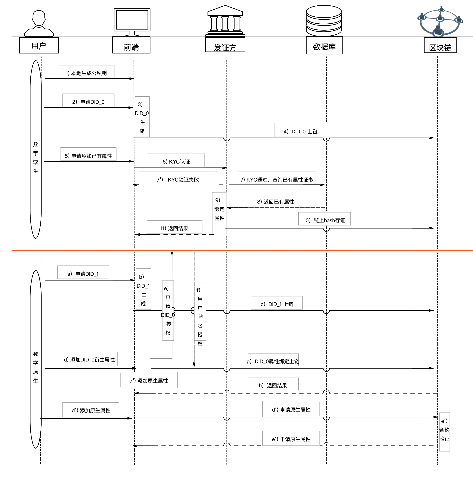

#  数字办公 2077 

## 1. 项目前景

### 1.1  项目背景

* 随着互联网技术发展，远程办公已成为不可或缺的办公方式之一
* 全球疫情的影响，导致部分海内外公司不得不采取远程办公的方式
* 远程办公可以有效减少通勤时间，降低公司场地租赁等运营成本


### 1. 2 行业痛点

* 随着技术发展，数字化转型为必然趋势
* 现实场地办公会带来较高的运维成本，同时也会给员工带来通勤时间和通勤成本的负担
* 远程办公会带来团队归属感薄弱，提高沟通成本等问题
* 现实办公存在工作效率底下，难以衡量工作产出的问题

  
### 1.3  技术难点
* 个人身份的数字化映射，数字身份的确权以及随之带来的数字身份的隐私性、安全性问题
* 虚拟世界构建，物品唯一性标示，虚拟世界物品转移确权问题
* 虚拟世界治理，经济模型，虚拟世界物品和人完整的生命周期
### 1.4  核心竞争力
* 合约管理

	通过合约实现NFT域名查询系统，提供边便捷的NFT检索功能。
支持链上合约逻辑动态升级。

* NFT映射

  将现实世界万物映射到数字孪生世界，以NFT形式呈现。
  由区块链保证NFT存证与确权。

* DID

  通过密码学生成个人DID信息，将Document存于链上。
  在链上建立个人DID与NFT资产的归属关联。

* 隐私检索

  使用密码学技术隐私集合求交（PSI）。
  在加入该世界时，在不暴露自己身份信息的同时，匿名查找已经注册的通讯录好友。

  

## 2  技术实现


### 2.1 系统架构

整体系统架构图


### 2.2  个人身份数字化映射-DID


* 数字身份的创建

  所有现实生活的人都可以有唯一一个数字孪生身份DID_0；每个人可以动态创建很多的身份，分布在的各个角落。每个身份的属性可以是现实世界中已有的（基于DID_0产生），也可以是在原生世界中铸造的；

* 属性的绑定

  每个DID所拥有的某些属性通过权威机构颁发相应的证书，某些属性也可以自动设置。在办公场景下，所有信息必须进行实名认证。针对一些隐私信息，DID的实体可以基于隐私证明算法的方式提供。例如，公司想收集某员工的妻子的年龄，出于隐私考虑不想泄露具体值，可以基于范围证明算法产生年龄段的范围。

* 属性更新与撤销

  针对一些具有实效性的属性，比如我是A部门的人员，但由于工作调整到部门B；因此需要HR进行工作属性的更新。同时，部门A对应的一些工作属性进行撤销。

  

  主要流程如下：

  

  

### 2.3  虚拟世界构建-NFT

1）虚拟世界NFT铸造

以办公场景为例，在该场景中存在多种不同类型的NFT，例如公司、部门、个人以及各类物品等。NFT的铸造者在铸造NFT时需要将该NFT的描述、类别、详细参数以及指导价格等以IPFS的形式进行
链上存储。通过智能合约，调用NFT铸造接口，将以上参数作为铸造NFT的元数据。

**不同类型的NFT的映射**
* 代表个人的NFT，需要和DID进行绑定，即现实到虚拟身份的映射；
* 代表物品的NFT在铸造之初就有所属权这个属性，所属权转移即代表该NFT的转移；


2）虚拟世界NFT价值传递

在虚拟世界中，NFT的交易和转移是基本的价值转移方式。个人可以通过DID绑定某个具有自然人属性的NFT所谓个人在虚拟世界的化身。通过该化身的身份，购买代表虚拟世界物品的NFT，从而完成虚拟世界物品的价值转移过程。

3）NFT销毁

为保证NFT生命周期的完整性，某些NFT在某种情况下可以由拥有者销毁。例如，某个电脑需要报废，由管理员发送某NFT销毁交易。

### 2.4 虚实结合方案

琪（实物交割）


### 2.5  经济模型及治理方式


#### 2.5.1 经济模型

  数字世界的流转的本质，就是数字价值的流转。为了实现价值合理流转和系统持续运行，必须依赖相对科学的经济模型。

* NFT 价值铸造

  * NFT的铸造权，采用分级授权的方式；项目方首先初始数字世界的NFT铸造；然后根据场景需要，可将铸造权进行委托。
  * NFT价值的锚定有最开始的铸造者确定相应的Token，后期由市场自由定价。

* 基础设施提供方激励

  根据投票方式，决定包括存储提供方、挖矿激励、开发者社区等激励；具体分配方式（略）。

  


#### 2.5.2 链上合约治理思想

整体设计思路：将合约业务逻辑、数据存储、⽤户接⼝解耦，采⽤代理合约+逻辑合约+存储合约的模块设计。优点是⽀持动态升级合约逻辑，不影响底层存储。
前提能⼒：PlatONE提供了合约命名服务，可以将部署在链上的合约地址映射到name+version的组合，并⽀持合约重定向功能，⽤户可以根据合约名和版本号调⽤指定合约（默认为版本号最⼤）

#### 2.5.3 治理对象
* 业务逻辑合约
* 链系统参数
* 节点准入等
* 链底层逻辑修改等

#### 2.5.4  治理方式

采用链上治理+链下治理相结合的方式

链上治理范围：
* 业务逻辑合约
* 链系统参数
* 节点准入等

链下治理范围：
* 链底层逻辑修改等

#### 2.5.5 治理流程
链上治理主要分为三个阶段：提议阶段、下院投票阶段、上院确认执⾏阶段
1. 提议阶段
提案可以由下院成员提出，也可以上院提出。提案类型包括委员会成员新增、合约逻辑更迭、合约新增等。
2. 下院投票阶段
下院成员可在合约的提案列表中查看等待执⾏公投的提案，并有权对之投票，若投赞成票的⼈数超过2/3（可定制），则进⼊上院确认执⾏阶段。
为确保响应性，设置了提案的最⻓存在时间t，如果⼀个提案在时间t内未能达成⼀致结果，则任何⼈都有权利将其关闭，或者发起同样类型的提案将之覆盖。
3. 上院投票阶段
某提案通过下院成员的表决后，上院成员可以表决其是否可以被执⾏，为提供⼀定的缓冲机制，上院成员应在⼀定的时间间隔后进⾏表决，在此期间，为此提案开通投票反悔机制，之前投赞成或反对票的成员可在此期间进⾏唯⼀⼀次的投票反悔。最终上院收集所有意⻅后决定是否执⾏或者否决该提案

### 2.6  其他


#### 2.6.1 分层账户体系

为了便于NFT管理，账户体系采用树的结果进行分层。父账户可以管理子账户，包括创建、转移、删除、更新账户信息等。

#### 2.6.2 存储机制

IPFS 存储


## 3  核心团队


###  人员及分工


团队核心成员毕业于国内一流高校人才，专注于区块链、密码学以及行业应用领域。成员均就职于万向区块链股份公司。


Chase Sun：  博士生，主要从事于网络空间安全、区块链领域的研究与开发工作。曾就职于某国家重点实验室，先后参与国家级、省部级重大项目若干项，申请发明专利10余项。（项目经理）


Vicky： 国内著名高校硕士毕业， 多年来从事于零知识证明、安全多方计算等新型密码算法研究与开发工作（密码学算法、经济治理）


J：国内双一流高校硕士研究生毕业，拥有多年区块链技术和行业研究经验，参与制定P3200s系列IEEE区块链国际标准制定（p3201技术负责人）。精通区块链底层技术，目前从事底层链优化和合约开发相关工作。（底层链&合约开发）

Menglu Zeng：国内著名高校硕士毕业硕士，拥有多年区块链相关领域的开发经验。（底层链&分布式存储）


Rachel Zhang：美国知名商学院MBA，Master of Business Analytics, 拥有丰富商业咨询、电子商务、AI、大数据分析等行业实操经验。（项目运营）


Chtholly：拥有多年前端开发工作经验，参与若干项区块链行业项目。（前端&UI）


## 4 附录


### 4.1 DID方案设计摘要

**基本数据结构**

```rust
//did的公钥结构，包含id、加密类型、公钥
pub struct DidPublicKey<A> {
	id: Vec<u8>,
	encrypt_type: Vec<u8>,
	publicKeyHex: A,
}

//did的service结构，包含id、加密类型、服务终端地址
pub struct DidService {
	id: Vec<u8>,
	encrypt_type: Vec<u8>,
	serviceEndpoint: Vec<u8>,
}

//did的proof结构，包含加密类型、创建者、对doc的签名
pub struct DidProof {
	encrypt_type: Vec<u8>,
	creator: Vec<u8>,
	signatureValue: Vec<u8>,
}


pub struct DidDoc<A> {
	context: Vec<u8>,                         //该字段为did背景信息
	id: Vec<u8>,                              //该字段为did的表示符
	version: u32,                             //该字段为did版本号，最初申请时为1    
	created: Vec<u8>,                         //该字段为did创建时间
	updated: Vec<u8>,                         //该字段为did最后更新时间
	publicKey: Vec<DidPublicKey<A>>,          //该字段为did的主密钥和恢复密钥两个结构体
	authentication: Vec<u8>,                  //该字段指定了主密钥id
	recovery: Vec<u8>,                        //该字段指定了恢复密钥id
	service: Vec<DidService>,                 //该字段为did的identityhub地址
	proof: Vec<DidProof>,                     //该字段为did证明
}


```

**DID链上存储创建**

```
接口名 
did_create

用户权限：
* did中主密钥地址

入参：
* did标识符(类型：Vec<u8>)
* did文本(类型：DidDoc<T::AccountId>)

返回值：无

**DID链上信息删除**

接口名 did_delete

用户权限：
* did中主密钥地址

入参：
* did标识符(类型：Vec<u8>)

返回值：无


DeleteDid(AccountId, u32)

**DID状态查询**

接口名 did_status_query

用户权限：
* did中主密钥地址

入参：
* did标识符(类型：Vec<u8>)

返回值：无

...略

```

###  4.2 NFT方案设计摘要


```c++
    const char* balanceOf(const char* _owner)  
    {
        num = _owner地址拥有的NFT数量；
        return num；
    }

    const char* ownerOf(uint32_t _tokenId) 
    {
        address = _tokenId对应的所有人
        return address;
    }
    uint32_t safeTransferFrom(const char* _from, const char* _to, uint32_t _tokenId, const char* data) const
    {
        1. 判断token所有权是否为_from
        2. 转移token所有权，先移除_from账户该token，然后在_to账户加上该token
        3. 变更token属性中的owner字段
    }


    uint32_t safeTransferFrom(const char* _from, const char* _to, uint32_t _tokenId) const
    {
        1. 判断token所有权是否为_from
        2. 转移token所有权，先移除_from账户该token，然后在_to账户加上该token
        3. 变更token属性中的owner字段
    }

    uint32_t transferFrom(const char* _from, const char* _to, uint32_t _tokenId) const
    {
        return safeTransferFrom(const char* _from, const char* _to, uint32_t _tokenId)
    }


    uint32_t approve(const char* _approved, uint32_t _tokenId) const
    {
        return 0;
    }


    uint32_t setApprovalForAll(address _operator, bool _approved) 
    {
        return 0/1;
    }

    const char* getApproved(uint256 _tokenId) 
    {
        return address;
    }


    uint32_t isApprovedForAll(const char* _owner, const char* _operator) 
    {
        return 0/1;
    }

    uint32_t totalSupply() const 
    {
        //获取所有NFT数量
        return sum;
    }

    const char* showTokenByIndex(uint32_t pagesize, uint32_t pagenum) 
    {
        //按照铸造顺序展示NFT以及其属性
        return json;
    }

    const char* showTokenOwnerByIndex(uint32_t pagesize, uint32_t pagenum) 
    {
        //展示所有拥有NFT的用户以及其拥有的NFT数量
        return json;
    }
    
    const char* name(uint32_t _tokenId) const 
    {
        //返回某idNFT的名称
        return name;
    }

    const char* symbol(uint32_t _tokenId) const 
    {
        //返回某idNFT的代号
        return symbol;
    }

    uint32_t mint(const char* _to, const char* metadata)
    {
        //铸造NFT，token id递增，元数据写入
        return 0/1;
    }

    uint32_t mortgage(const char* _to, uint32_t tokenId)
    {
        //质押某NFT给某人，更改NFT状态，解除质押前不能交易以及再次质押
        return 0/1;
    }

    uint32_t redeem(const char* _from, uint32_t tokenId)
    {
        //赎回质押的NFT
        return 0/1;
    }

    uint32_t mortgageFrom(const char* _from, const char* _to, uint32_t tokenId)
    {
        //从某个账户将某个NFT转移给其他人
        return 0/1;
    }

    uint32_t cancelApprove(uint32_t tokenId)
    {
        //取消对某自己的tokenId的批准
        return 0/1;
    }
    
    uint32_t approveMortgage(const char* _approved, uint32_t _tokenId)
    {
        //批准某账户抵押自身某个NFT
        return 0/1;
    }
    
    uint32_t setApprovalMortgageForAll(address _operator, bool _approved) 
    {
        return 0/1;
    }    

    uint32_t changeMutableAttr(const char* tokenId, const char* MetaData)
    {
        return 0/1;
    }

}
```


```c++
typedef bcwasm::db::Map<MutableAttrMapName, string, string> MutableAttrMap_t;

struct MutableAttr{
    MutableAttrMap_t mmap;
    BCWASM_SERIALIZE();
}

struct MetaData{
    uint32_t        tokenId;        //该NFT的id
    string          name;           //该NFT的名称
    string          symbol;         //该NFT的代号
    string          description;    //描述
    string          status;         //该NFT的状态，暂时有质押、冻结等
    string          owner;          //NFT所有人
  	string					holder;
    //vecter<string>  user;           //该NFT的使用人列表
    string          url;            //外部链接
    struct MutableAttr muattr;      //NFT可变属性，不影响基础交易等逻辑
    BCWASM_SERIALIZE();
}


```


### 4.3 治理合约设计摘要


```c++
typedef bcwasm::db::Map<"proposal", string("proposal"),  std::vector<string>> CurrentProposalListMap_t;

typedef bcwasm::db::Map<"proposal", string("historyproposal"),  std::vector<string>> HistoryProposalListMap_t;

typedef bcwasm::db::Map<"proposal", string(proposal_id),  Proposal> ProposalMap_t;

typedef bcwasm::db::Map<"department", string("department"),  Department> DepartmentMap_t;

typedef bcwasm::db::Map<"contracts", string(name),  Contracts> ContractsMap_t;

typedef bcwasm::db::Map<"personalvotelist", string(name),  std::vector<PersonalVoteList>> PersonalVoteListMap_t;

typedef bcwasm::db::Map<"historycontracts", string(name),  std::vector<Contracts>> HistoryContractsMap_t;

typedef bcwasm::db::Map<"proposaltype", string(proposaltype),  std::vector<ProposalType>> ProposalTypeMap_t;


```

